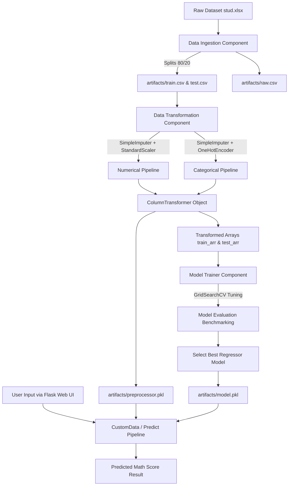

# 🎓 Student Score Prediction — End-to-End Machine Learning Project

[](https://www.python.org/)
[](https://flask.palletsprojects.com/)
[](https://scikit-learn.org/)
[](#license)
[]()

> An end-to-end production-grade Machine Learning application to predict student **Maths Scores** based on demographic factors, educational backgrounds, and other academic performance indicators. Built with an automated data pipeline, robust preprocessing, hyperparameter optimization, custom logging/exception handling, and an interactive Flask web application.

---

## 📌 Table of Contents

- [Overview](#-overview)
- [Problem Statement](#-problem-statement)
- [Dataset & Features](#-dataset--features)
- [Project Architecture & Workflow](#-project-architecture--workflow)
- [Directory Structure](#-directory-structure)
- [Core Components](#-core-components)
  - [1. Data Ingestion](#1-data-ingestion)
  - [2. Data Transformation](#2-data-transformation)
  - [3. Model Training & Hyperparameter Tuning](#3-model-training--hyperparameter-tuning)
  - [4. Prediction Pipeline](#4-prediction-pipeline)
  - [5. Exception Handling & Logging](#5-exception-handling--logging)
- [Machine Learning Models & Evaluation](#-machine-learning-models--evaluation)
- [Installation & Setup](#-installation--setup)
- [Usage Guide](#-usage-guide)
  - [Running the Training Pipeline](#running-the-training-pipeline)
  - [Running the Web Application](#running-the-web-application)
- [Web Interface Demo](#-web-interface-demo)
- [Technologies & Tools](#-technologies--tools)
- [Future Enhancements](#-future-enhancements)
- [Author & Acknowledgements](#-author--acknowledgements)

---

## 📖 Overview

In modern education, understanding the factors that influence academic performance is crucial for educators, parents, and policymakers. This project implements a full lifecycle Machine Learning solution:
- Comprehensive Exploratory Data Analysis (EDA) and visualization.
- Automated ETL pipeline for data ingestion, validation, and train-test splitting.
- Multi-step preprocessing (missing value imputation, standard scaling, and one-hot encoding).
- Model evaluation across multiple regression algorithms with grid-search hyperparameter tuning.
- Interactive user interface built with Flask for real-time score prediction.
- Enterprise-grade modular code architecture adhering to best software engineering practices.

---

## 🎯 Problem Statement

The objective is to predict a student's **Math Score** (0 - 100) by analyzing:
1. Demographic attributes (Gender, Ethnicity).
2. Socioeconomic factors (Parental Level of Education, Lunch Type).
3. Academic preparation (Test Preparation Course completion).
4. Correlated academic scores (Reading Score, Writing Score).

---

## 📊 Dataset & Features

The dataset comprises student examination records with demographic and test result variables:

| Feature Name | Data Type | Type | Description / Values |
| :--- | :--- | :--- | :--- |
| `gender` | Categorical | Input | `male`, `female` |
| `race_ethnicity` | Categorical | Input | `group A`, `group B`, `group C`, `group D`, `group E` |
| `parental_level_of_education` | Categorical | Input | `some high school`, `high school`, `some college`, `associate's degree`, `bachelor's degree`, `master's degree` |
| `lunch` | Categorical | Input | `standard`, `free/reduced` |
| `test_preparation_course` | Categorical | Input | `none`, `completed` |
| `reading_score` | Numerical | Input | Student's reading test score ($0 - 100$) |
| `writing_score` | Numerical | Input | Student's writing test score ($0 - 100$) |
| **`math_score`** | Numerical | **Target** | **Student's math test score ($0 - 100$)** |

---

## 🏗️ Project Architecture & Workflow

The pipeline executes through a sequence of decoupled modules:



---

## 📂 Directory Structure

```plaintext
mlproject/
├── .gitignore                      # Git ignore file
├── app.py                          # Flask Web Application & API routes
├── main.py                         # Application entrypoint
├── requirements.txt                # Project dependencies
├── setup.py                        # Package distribution script
├── pyproject.toml                  # Build tool configuration
├── uv.lock                         # Lockfile for dependency management
│
├── artifacts/                      # Generated pipeline artifacts (persisted objects)
│   ├── raw.csv                     # Ingested raw dataset
│   ├── train.csv                   # Training split (80%)
│   ├── test.csv                    # Testing split (20%)
│   ├── preprocessor.pkl            # Serialized preprocessor pipeline
│   └── model.pkl                   # Serialized best trained ML model
│
├── logs/                           # Auto-generated execution logs
│   └── <timestamp>.log             # Formatted logs with tracebacks
│
├── notebook/                       # Jupyter Notebooks for exploration
│   ├── data/
│   │   └── stud.xlsx               # Source raw dataset
│   ├── 1 . EDA STUDENT PERFORMANCE.ipynb # Exploratory Data Analysis & Visualizations
│   └── 2. MODEL TRAINING.ipynb     # Model experimentation & prototyping
│
├── src/                            # Modular source code
│   ├── __init__.py                 # Package marker
│   ├── exception.py                # Custom exception handler with detailed trace
│   ├── logger.py                   # Centralized logging configuration
│   ├── utils.py                    # Utility helpers (save_object, evaluate_models, etc.)
│   │
│   ├── components/                 # Core pipeline components
│   │   ├── __init__.py
│   │   ├── data_ingestions.py      # Data ingestion & train/test partitioning
│   │   ├── data_transformation.py  # Preprocessing pipelines & feature encoding
│   │   └── model_trainer.py        # Model benchmarking & hyperparameter optimization
│   │
│   └── pipeline/                   # Execution pipelines
│       ├── __init__.py
│       ├── train_pipeline.py       # End-to-end training pipeline orchestrator
│       └── predict_pipeline.py     # Inference pipeline with custom data wrapper
│
└── templates/                      # Flask HTML templates
    ├── index.html                  # Welcome landing page
    └── home.html                   # Prediction input form & results display
```

---

## ⚙️ Core Components

### 1. Data Ingestion
- **File**: `src/components/data_ingestions.py`
- Loads raw data from `notebook/data/stud.xlsx`.
- Validates directories and saves `raw.csv` under `artifacts/`.
- Performs an 80/20 stratified train-test split (`random_state=42`) and outputs `train.csv` and `test.csv`.

### 2. Data Transformation
- **File**: `src/components/data_transformation.py`
- Constructs specialized preprocessing pipelines:
  - **Numerical Features** (`reading_score`, `writing_score`): Missing value imputation via `median`, followed by `StandardScaler`.
  - **Categorical Features** (`gender`, `race_ethnicity`, `parental_level_of_education`, `lunch`, `test_preparation_course`): Missing value imputation via `most_frequent`, followed by `OneHotEncoder`.
- Bundles features using `ColumnTransformer`.
- Fits on training data, transforms both train and test splits, and serializes the transformer to `artifacts/preprocessor.pkl`.

### 3. Model Training & Hyperparameter Tuning
- **File**: `src/components/model_trainer.py`
- Evaluates multiple regression algorithms with `GridSearchCV` (3-fold cross-validation, R^2 scoring):
  - **Decision Tree Regressor** (criterion, max_depth, min_samples_split, min_samples_leaf)
  - **Random Forest Regressor** (n_estimators, max_depth, min_samples_split, min_samples_leaf)
  - **Gradient Boosting Regressor** (n_estimators, learning_rate, max_depth, subsample)
  - **Linear Regression**
  - **XGBoost Regressor** (n_estimators, learning_rate, max_depth, subsample)
  - **CatBoost Regressor** (iterations, depth, learning_rate)
  - **AdaBoost Regressor** (n_estimators, learning_rate)
- Selects the top-performing model exceeding the score threshold (R^2 \ge 0.6) and serializes it to `artifacts/model.pkl`.

### 4. Prediction Pipeline
- **File**: `src/pipeline/predict_pipeline.py`
- Exposes:
  - `CustomData`: Maps input features from web requests or APIs into structured `pandas.DataFrame`.
  - `PredicPipeline`: Loads `artifacts/preprocessor.pkl` and `artifacts/model.pkl` to generate predictions for new data points.

### 5. Exception Handling & Logging
- **Files**: `src/exception.py`, `src/logger.py`
- Custom `CustomException` formats detailed error strings with exact file names and line numbers.
- Centralized logger writes runtime events with timestamps and log levels into the `logs/` directory.

---

## 🤖 Machine Learning Models & Evaluation

The training framework systematically compares multiple regressors using $R^2$ Score (Coefficient of Determination):

```
       R² Score = 1 - (SS_res / SS_tot)
```

| Model | Hyperparameter Search Space |
| :--- | :--- |
| **Linear Regression** | Default baseline |
| **Decision Tree** | `criterion`, `max_depth: [None, 5, 10]`, `min_samples_split: [2, 5]` |
| **Random Forest** | `n_estimators: [50, 100]`, `max_depth: [None, 10]`, `min_samples_split: [2, 5]` |
| **Gradient Boosting** | `n_estimators: [50, 100]`, `learning_rate: [0.05, 0.1]`, `subsample: [0.8, 1.0]` |
| **XGBoost** | `n_estimators: [50, 100]`, `learning_rate: [0.05, 0.1]`, `max_depth: [3, 5]` |
| **CatBoost** | `iterations: [100, 200]`, `depth: [4, 6]`, `learning_rate: [0.05, 0.1]` |
| **AdaBoost** | `n_estimators: [50, 100]`, `learning_rate: [0.05, 0.1]` |

---

## 🚀 Installation & Setup

### Prerequisites
- Python 3.8 to 3.12 installed on your system.
- Git installed.

### 1. Clone the Repository
```bash
git clone https://github.com/alphacrypto246/Student-Score-Prediction.git
cd Student-Score-Prediction
```

### 2. Create and Activate a Virtual Environment

**On Windows (PowerShell):**
```powershell
python -m venv .venv
.venv\Scripts\Activate.ps1
```

**On Linux / macOS:**
```bash
python3 -m venv .venv
source .venv/bin/activate
```

### 3. Install Dependencies
```bash
pip install --upgrade pip
pip install -r requirements.txt
```

*(Optional) Install the package in editable mode:*
```bash
pip install -e .
```

---

## 💻 Usage Guide

### Running the Training Pipeline
To execute the end-to-end data ingestion, transformation, and model training workflow:

```bash
python src/components/data_ingestions.py
```

This will:
1. Ingest `notebook/data/stud.xlsx`.
2. Generate `train.csv`, `test.csv`, and `raw.csv` in `artifacts/`.
3. Fit and save the preprocessing pipeline to `artifacts/preprocessor.pkl`.
4. Train and tune all regression models, output the best $R^2$ score, and save the best model to `artifacts/model.pkl`.

---

### Running the Web Application
Launch the Flask development server:

```bash
python app.py
```

Once running, access the web application in your browser at:
- **Home / Welcome**: `http://127.0.0.1:5000/`
- **Prediction Form**: `http://127.0.0.1:5000/predictdata`

---

## 🌐 Web Interface Demo

1. Navigate to `http://127.0.0.1:5000/predictdata`.
2. Enter student attributes:
   - Select **Gender**, **Ethnicity**, and **Parental Level of Education**.
   - Select **Lunch Type** and **Test Preparation Course**.
   - Input **Reading Score** ($0-100$) and **Writing Score** ($0-100$).
3. Click **Predict your Maths Score**.
4. The estimated Math Score is calculated and displayed instantly on screen.

---

## 🛠️ Technologies & Tools

| Category | Technologies |
| :--- | :--- |
| **Core Language** | Python 3.10+ |
| **Web Framework** | Flask, Jinja2, HTML5/CSS3 |
| **Machine Learning** | Scikit-Learn, XGBoost, CatBoost |
| **Data Processing** | Pandas, NumPy, OpenPyXL |
| **Data Visualization** | Matplotlib, Seaborn |
| **Model Serialization** | Pickle, Dill |
| **Package Management** | Setuptools, pip, uv |

---

## 🔮 Future Enhancements

- [ ] Add Docker containerization (`Dockerfile` and `docker-compose.yml`) for seamless deployment.
- [ ] Build CI/CD workflow with GitHub Actions.
- [ ] Deploy to cloud platforms (AWS Elastic Beanstalk / Azure App Service / Render / Hugging Face Spaces).
- [ ] Add unit tests and integration tests using `pytest`.
- [ ] Implement model monitoring and MLflow / DVC experiment tracking.

---

## 👤 Author & Acknowledgements

- **Author**: Arya Deep Chowdhury
- **Email**: [arya.d.chowdhury@gmail.com](mailto:arya.d.chowdhury@gmail.com)
- **GitHub**: [@alphacrypto246](https://github.com/alphacrypto246)

---

## 📄 License

This project is licensed under the MIT License — see the [LICENSE](LICENSE) file for details.
